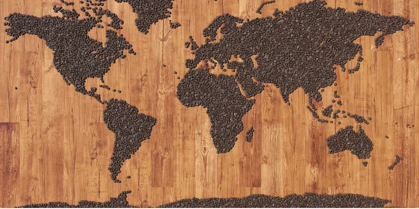

## Coffee In The World

This Shiny App is for searching and visulizating coffee data from up to 83 countries. It provides different coffee information including Production, Domestic Cosumption, Import, Export for users to explore.

The data source is from United States Department of Agriculture.
USDA’s coffee dataset (link:
https://apps.fas.usda.gov/psdonline/app/index.html#/app/downloads )

This is Tabular data with 71193 rows x 12 columns, it has both temporal attributes and simple text. This Shiny App will focus on the visulization of Production, Domestic Cosumption, Import and Export by differnent countries in 20 years.  

Author: Yang Luo 